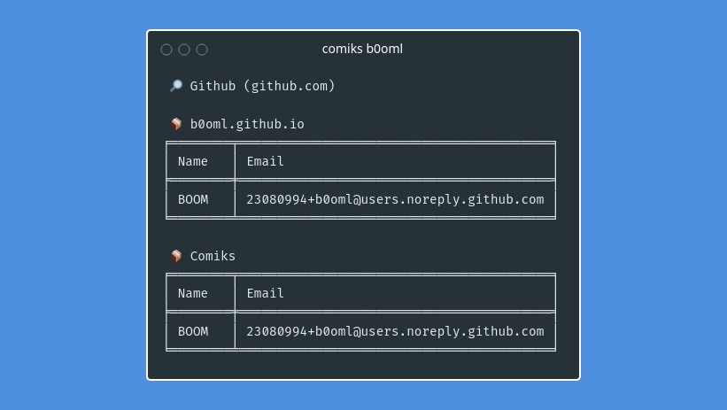

# Comiks

Comiks is a command line tool to retrieve authors informations (names and emails) in the repository commits of a given user.



## Installation

```shell
$ pip install git+https://github.com/b0oml/Comiks
```

## Configuration

The first time `comiks` runs, it will generate a config file `.config/comiks/config.toml` in your home directory. This will be the default configuration file used when using comiks.

By default, only Github provider is enabled, other providers needs an API key/access token. To enable and configure others providers, you can update the configuration file in your home directory.

It is also possible to load the configuration file from another path with option `-c, --config`.

```shell
$ comiks -c ./path/to/config.toml username
```

If you wan to create your own configuration file, you can take example on [this one](./comiks/config.toml).

## Usage

```shell
$ comiks --help
usage: comiks [-h] [-c CONFIG] [-l HIGHLIGHT] [-t TAGS] username

Retrieve authors informations from commits.

positional arguments:
  username              Username for which to scan commits.

optional arguments:
  -h, --help            show this help message and exit
  -c CONFIG, --config CONFIG
                        Custom config file (default is ~/.config/comiks/config.toml).
  -l HIGHLIGHT, --highlight HIGHLIGHT
                        Strings to highlight in output, separated by a comma (default is username).
  -t TAGS, --tags TAGS  Comma-sperated list of tags to select which providers to enable (default in
                        config).
```
